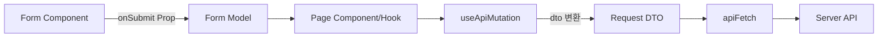
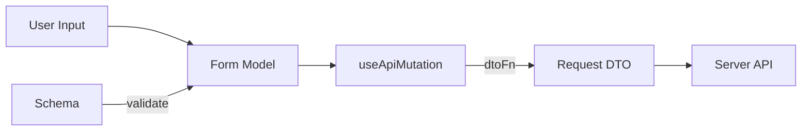
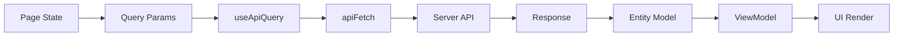

# 6.6 폼/모델/DTO 분리 기준

## 목적

입력(Form)과 도메인 모델(Model), 서버 전송 데이터(DTO)를 분리해 책임을 명확히 하고, 검증/변환/캐시 갱신 흐름을 일관되게 유지한다.

## 핵심 원칙

- Form Component는 입력/검증을 담당하고 `Form Model`을 전달한다.
- `Form Model`과 `Request DTO`는 `features/*/model/types.ts`에서 정의한다.
- DTO 변환은 feature model의 mutation(`useApiMutation`의 `dtoFn`)에서 수행한다.
- 서버 응답은 Query 캐시에 저장되고, UI는 캐시 기반으로 갱신한다.

## 6.6 전체 흐름

---

## 6.6.1 입력 흐름 (Schema/Model/DTO 관계)

### 정의

- `Schema`: Form Model의 입력 규칙을 검증한다. (`resolver` 또는 RHF rules에 연결)
- `Form Model`: UI 입력 상태의 구조이며, Form Component가 생성/관리한다.
- `Request DTO`: 서버로 전달되는 payload이며, mutation의 `dtoFn`에서 Form Model을 변환해 만든다.

### 입력 파이프라인

---

## 6.6.2 조회 흐름 (Query/Response/ViewModel 관계)

### 정의

- `Query Params`: 화면 상태에서 필요한 조회 파라미터를 구성한다.
- `useApiQuery`: `queryKey + endpoint`를 기준으로 서버 상태를 조회한다.
- `Response Model`: 서버 응답을 entities 모델(schema)로 검증한다.
- `ViewModel`: 응답 데이터를 화면에 필요한 형태로 매핑한다.

### 조회 파이프라인

---

## 구현 체크리스트

1. Form Component가 DTO를 직접 만들고 있지 않은가
2. `dtoFn`에서만 Form Model → DTO 변환이 일어나는가
3. Schema 검증 규칙이 Form Model 구조와 일치하는가
4. Query 응답이 Entity 검증 단계를 거치는가
5. UI가 서버 응답 원본 대신 ViewModel을 사용하고 있는가
6. mutation 성공 후 캐시 무효화/갱신 전략이 정의되어 있는가

---

## 한 줄 정리

입력은 Form Model로, 전송은 DTO로, 조회 결과는 Entity/ViewModel로 분리해서 각 레이어의 책임을 고정한다.
