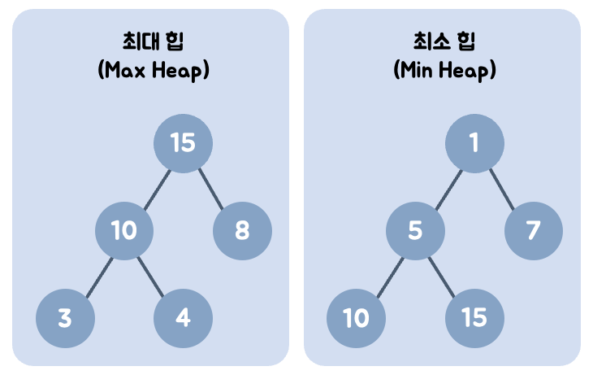

## 우선순위 큐와 힙
> 우선순위 큐
- 일반 큐와 달리 값의 우선순위에 따라 먼저 나가는 자료구조
> 힙(Heap)
- 우선순위 큐를 효율적으로 구현하기 위한 완전 이진 트리 기반
- 힙으로 우선순위 큐가 구현된다.
- 배열로 표현 가능 : 인덱스로 부모-자식 관계 계산 가능
  - 시간복잡도 : 삽입/삭제 → O(log N)

- 큐 배열안은 기본적으로 정렬되어있지 않다.
  - 힙 구조에서 정렬되어있는 것을 기준으로 했기 때문

루트 값에 따라 종류 2가지
1. 최소힙
  1. 부모 ≤ 자식 : 항상 루트가 최솟값이다.
2. 최대힙
  1. 부모 ≥ 자식 : 항상 루트가 최댓값이다.

> 최소힙의 삭제
1. 루트노드 삭제
2. 마지막 리프노드를 루트노드로 올린다.
3. (탑다운)비교를 통해 아래로 내려간다.
  1. 부모 ≤ 자식 
  2. 비교를 통해 내려간다.

> 최소힙의 삽입
1. 마지막 리프노드에 추가한다.
2. (바텀업)비료를 통해 위로 올라간다.
  1. 부모 ≤ 자식
  2. 항상 왼쪽부터 오른쪽으로

### 노드의 인덱스 값 구하기.
- 노드의 인덱스 i의 왼쪽 자식 : 2\*i + 1
- 노드의 인덱스 i의 오른쪽 자식 : 2\*i + 2
- 노드의 인덱스 i의 부모 : Math.floor((i-1)/2)
```javascript
// ex)
// 배열 인덱스:[0, 1, 2, 3, 4]
// 값: [10, 15, 20, 17, 25]
10
/ \
15 20
/ \
17 25
```


> ❓ 왜 힙이 우선순위 큐를 구현하는 방식인걸까?
> ---
> - extract :
> - ← 10(0)\[삭제\] \| 15(1) \| 20(2) \| 17(3) \| 25(4)
> - insert :
> - 10(0) \| 15(1) \| 20(2) \| 17(3) \| 25(4) \| 27(5)\[추가\] ←
> → 형태 자체는 배열이 큐 형태이다.

### 인덱스를 구하는 공식 이유
- depth로 내려갈수록 2의 n제곱
  → 노드 하나당 2개의 자식이 있기 때문이다.
- 전제조건 : 힙은 완전 이진 트리이기 때문에 마지막 요소를 제외하고 항상 꽉 차있다.
- Depth 0 1 2일때,
  - depth = 0 : 2\^0 = 1개 존재, 해당 층의 시작 노드의 인덱스는 2\^0 = 0
  - depth = 1 : 2\^1 = 2개 존재, 해당 층의 시작 노드의 인덱스는 2\^1-1 = 1
  - depth = 2 : 2\^2 = 4개 존재, 해당 층의 시작 노드의 인덱스는 2\^2-1 = 3
    - 항상 시작노드의 인덱스에 -1인 이유는 인덱스는 0부터 시작하기 때문이다.
  - 2\^depth - 1 = 시작노드 인덱스 \| 2\^depth = 해당 층 노드 갯수

> 예시)
> i = 5일때, 2\^2-1 \< 5 \< 2\^3-1 이기 때문에, 5가 있는 2층은 3 4 5 6 이다.
> 해당 층에 5 앞에 있는 노드는 2개고 해당 노드이기 때문에 다음층에 번식되어 생긴 노드는 4개일테지.
> 때문에 이번 층의 마지막 노드인 6번 + 4 이후 다음 인덱스가 5의 자식이다.
> → 수식으로 나타내면, 2\*i+1

---
### 예제 코드
최소 힙
> ### 💡 정리
> ---
> - extractMin은 반환값존재 ! 가장 최대/최솟값을 반환하기 위해 사용한다.
> - heapifyDown() 사용
> - 내려가야 되기때문에 자식 탐색 (leftChildIndex, rightChildIndex) 필요
> - insert는 삽입한다.
> - heapifyUp() 사용
> - 올라가야되기 때문에 부모 탐색 (parentIndex) 필요
> - heapifyUp/Down 둘다 break조건 존재

```javascript
class MinHeap{
  constructor(){
    this.heap = [];
  }
  insert(value){
    this.heap.push(value)
    this.heapifyUp();

  }
  swap(i,j){
    [this.heap[i], this.heap[j]]=[this.heap[j], this.heap[i]];
  }
  extractMin(){
    if(this.heap.length === 0) return null;
    if(this.heap.length === 1) return this.heap.pop();

    const min = this.heap[0];

    this.heap[0] = this.heap.pop();

    this.heapifyDown();
    return min;
  }
  heapifyUp(){
    let index = this.heap.length-1;

    while(index>0){
      //1. 부모 인덱스 확인하기
      const parentIndex = Math.floor((index-1)/2);

      //1-1. 부모보다 자식이 더 크면 스탑
      if(this.heap[parentIndex] <= this.heap[index]) break;

      //1-2. 그게 아니라면 부모와 자식 위치를 바꾼다.
      this.swap(parentIndex, index);

      index = parentIndex
    }
  }
  heapifyDown(){
    let currentIndex = 0;
    const length = this.heap.length;

    while(true){
      let minIndex = currentIndex;
      const leftIndex = currentIndex * 2 + 1;
      const rightIndex = currentIndex * 2 + 2;


      //1. 탐색 :  minIndex 메모리에 작은 값 넣어두기
      if(leftIndex < length && this.heap[leftIndex] < this.heap[minIndex]){
        minIndex = leftIndex;
      }
      if(rightIndex < length && this.heap[rightIndex] < this.heap[minIndex]){
        minIndex = rightIndex;
      }

      if(minIndex === currentIndex) break;

      //2. 자리바꾸기 : 확정 시 자리 바꾸기
      this.swap(minIndex, currentIndex);
      currentIndex = minIndex;
    }
  }
}
```

최대 힙
- 아래로 내려갈수록 숫자가 작아진다.
```javascript
class MaxHeap {
  constructor() {
    this.heap = [];
  }

  insert(value) {
    this.heap.push(value);
    this.heapifyUp();
  }

  swap(i, j) {
    [this.heap[i], this.heap[j]] = [this.heap[j], this.heap[i]];
  }

  extractMax() {
    if (this.heap.length === 0) return null;
    if (this.heap.length === 1) return this.heap.pop();

    const max = this.heap[0];

    // 마지막 노드를 루트로 올림
    this.heap[0] = this.heap.pop();

    // 아래로 내려가면서 정렬
    this.heapifyDown();

    return max;
  }

  heapifyUp() {
    let currentIndex = this.heap.length - 1;

    while (index > 0) {
      const parentIndex = Math.floor((currentIndex - 1) / 2);

      // 최소 힙과 반대: 부모가 더 크면 멈춤
      if (this.heap[parentIndex] >= this.heap[currentIndex]) break;

      this.swap(parentIndex, currentIndex);
      currentIndex = parentIndex;
    }
  }

  heapifyDown() {
    let currentIndex = 0;
    const length = this.heap.length;

    while (true) {
      let maxIndex = currentIndex;
      const leftIndex = 2 * currentIndex + 1;
      const rightIndex = 2 * currentIndex + 2;

      //최소 힙과 반대 비교
      if (leftIndex < length && this.heap[leftIndex] > this.heap[maxIndex]) {
        maxIndex = leftIndex;
      }

      if (rightIndex < length && this.heap[rightIndex] > this.heap[maxIndex]) {
        maxIndex = rightIndex;
      }

      if (maxIndex === currentIndex) break;

      this.swap(maxIndex, currentIndex);
      currentIndex = maxIndex;
    }
  }
}

```
---
### 코테에서 최대힙과 최소힙을 구현하는 방법
- 최대힙을 구현하고
  - 넣을 때 -를 붙인다.
  - 예시 :
    - minHeap.insert(-value);
    - const max = -minHeap.extractMin();

  ```javascript
5, 3, 10
-> -5 -3 -10
최소힙 : 3이 가장 작지만
최대힙에서는 : -10이 가장 작다.
  ```

---
