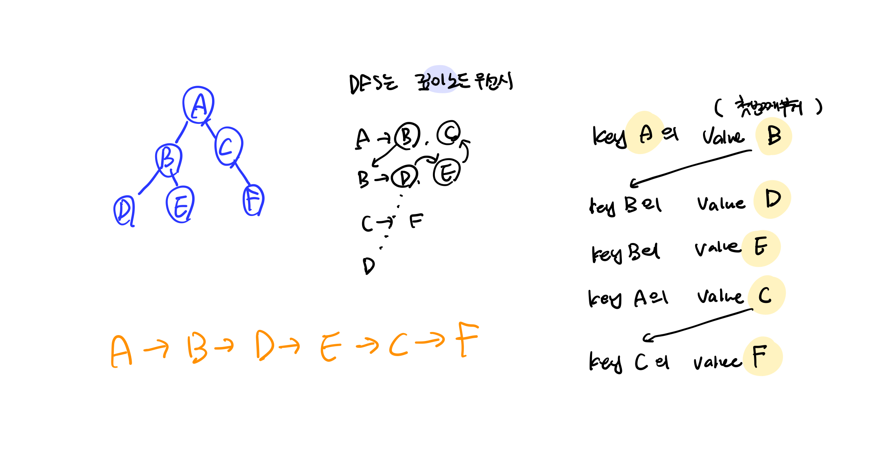
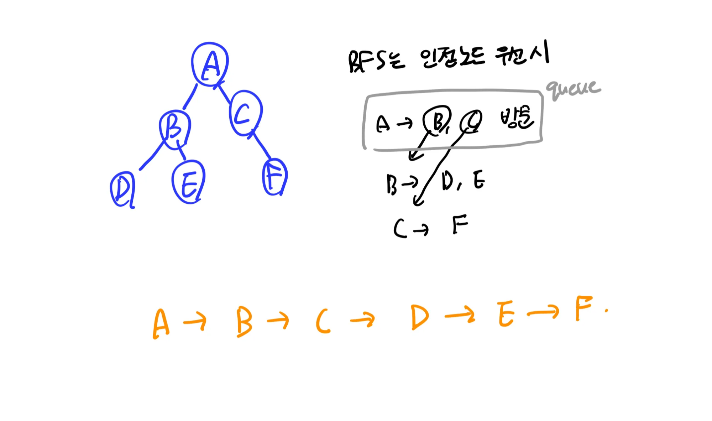
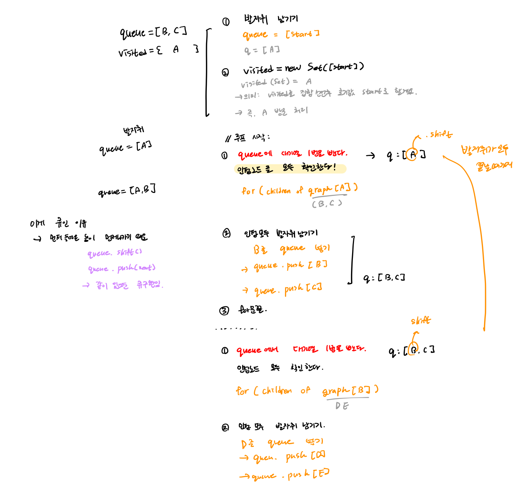

## DFS


- 입력 데이터는 그래프에 따라 다양하게 들어올 수 있다. 

> 인접 배열
```javascript
const graph = [
  [1,0,1],
  [0,1,0],
  [1,0,1]
]
```
> 인접 리스트
```javascript
const graph = {
    "A":["B","C"],
    "B":["D","E"],
    "C":["F"]
}
```
> 하나의 key의 value를 한번 순회할 때 모두 queue(발견된 노드 모음)에 넣는다!

### 개념
- 깊이 우선 탐색 (Depth-FS)
  - 최대한 깊이 내려간 후 더이상 길이 없을 때 옆으로 이동
  - 루트 노드에서 다음 분기로 넘어가기 전에 해당 분기를 완벽하게 탐색하는 방법
  - 활용 : 미로 
  - 스택 또는 재귀함수 

### ⭐️ 탐색 순서
1. 발급 받은 키의 인접한 값을 확인한다.
2. 인접한 값이 방문하지 않은 노드라면,
  1. 다시 해당 노드의 인접한 값을 확인한다. (1번 반복)(dfs 재귀)
→ 자연스럽게 백트래킹이 가능함.


### 구현 순서
1. visited 생성
2. DFS 함수 정의
  1. 현재 노드 방문 처리
  2. 인접 노드 확인
  3. 방문 안한 노드는 다시 dfs 
3. 시작 노드에서 DFS 호출

### 구현 순서
> 인접 리스트일때
```javascript

function dfs(start, graph, visited=new Set()){
    visited.add(start); //맨처음 때문에 여기에 둠

    for(const children of graph[start]){
        if(!visited.has(children)){
            // visited.add(start); 여기도 되긴한데
            dfs(children,graph,visited)
        }
    }

}
```

> 인접 행렬일때 
```javascript
function dfs(start, graph, visited = new Set()) {
    visited.add(start);

    for (let next = 0; next < graph.length; next++) {
        // start와 next가 연결되어 있고
        // 아직 방문하지 않았다면
        if (graph[start][next] === 1 && !visited.has(next)) {
            dfs(next, graph, visited);
        }
    }
}
```

### 바뀌는 부분
리스트일 때:
```javascript
for (const child of graph[start])
```
행렬일 때:
```javascript
for (let next=0; next<n ;next++)
```
그리고
```text
graph[start][next]===1
```
조건이 추가된다.

---
### 인접 리스트와 인접 행렬의 차이
인접 리스트는 “연결된 것만 순회”
인접 행렬은 “전체를 돌면서 연결 여부 확인”
---

### 팁
- 그래프 탐색 문제는 보통 인접 리스트 또는 인접 행렬로 바꿔서 탐색함.
  - 예) \[ \[ 1, 2 \], \[ 2, 5 \], \[ 5, 1 \], \[ 3, 4 \], \[ 4, 6 \] \] 이런식으로 되어있으면 인접 리스트로 바꾸는 것을 추천
    - 결과 
      ```javascript
graph = [
  [],
  [2,5],
  [1,5],
  [4],
  [3,6],
  [2,1],
  [4]
]
      ```

- 인접 리스트로 바꾸는 이유 : 연결된 것만 순회하기 때문.
  - 인접 행렬 : 전체를 돌면서 연결 여부를 확인하기 때문에 성능 저하발생
---


---

## BFS


```javascript
const graph = {
    "A":["B","C"],
    "B":["D","E"],
    "C":["F"]
}
```
> 하나의 key의 value를 한번 순회할 때 모두 queue(발견된 노드 모음)에 넣는다!


### 개념
- 너비 우선 탐색 (BreadthFS)
  - 최대한 넓게 이동한 다음 더 이상 이동할 수 없을때 아래로 이동
  - 루트 노드에서 인접한 노드(children)를 먼저 탐색 
  - 활용 : 최단 경로 찾기
  - 큐 이용
    - 이게 큐인 이유
      - queue.shift() / queue.push(next) 가 함께 구현되어있기 때문임.

### ⭐️ 탐색 순서
1. 탐색할 노드들을 모두 queue에 넣는다. 
2. 탐색한 노드들은 반드시 visited에 넣는다.
3. queue에서 가장 먼저 발견된 노드부터 인접 노드를 확인한다.


- 각각의 의미
  - queue : 발견은 했지만 인접노드를 탐색하지 않은 노드 모음
    - queue는 보류 처리된 노드라고 생각하기
  - visited : 방문처리가 된 노드들

### 구현 순서
1. queue 생성하고 무조건 start 넣음
2. visited 집합 생성
3. 시작노드를 queue에 넣고 visited에 넣기(방문 처리)
  //여기까지는 초기 설정
4. queue가 빌때까지 1차 반복(그래서 첫발때 start를 넣어둠)
  1. queue에서 가장 먼저 발견된 대기열 1번 노드부터 꺼낸다(.shift)
  2. 인접 노드 탐색(2차 반복)하여 queue에 넣는다. 
  3. 방문안했을 경우(처음 발견할 경우), queue에 넣고 visited 처리

> 수도 코드로 표현
```javascript
function bfs(){
  const queue =[root];
  while(queue.length > 0){
    const node = queue.shift();
    console.log(node.value);
    queue.push(...node.children);
  }
}
```
```javascript
function bfs(start, graph){
    const queue = [start];
    const visited = new Set([start]);
    let head = 0;

    //queue : 발자취가 모두 끝날때까지
    while(queue.length > head){
        let node = queue[head++];


        for(const children of graph[node]){
            console.log(children);
            if(!visited.has(children))
                visited.add(children);
                queue.push(children);
        }
    }

}

bfs("A", graph);
```
> ❓ const node = queue.shift(); 를 사용하지 않는 이유
> `shift()`는 O(n)이라 커지면 느려질 수 있다. 때문에 습관적으로 사용하지 않도록하자.


<details>
<summary>❓visited를 사용하지 않고 queue에 있는 요소를 확인하는 건 어때?</summary>
  queue는 아직 노드를 확인했지만 인접 요소를 확인하지 않은 요소의 집합이다.
  즉, 방문 예정인 노드들이 잠시 저장되는 공간 때문에 visited로 방문한 노드들을 모아둘 공간이 필요하다.
</details>


## 절차 정리

#  BFS에서 절대 잊으면 안 되는 3가지
## 1. 큐 (Queue)
> BFS는 “먼저 들어온 걸 먼저 처리”한다.
그래서 반드시 FIFO 구조가 필요함.
```javascript
queue.push(...)
queue.shift()
```
또는
```javascript
let head = 0
while (head < queue.length)
```
---
## 2. 방문 처리 (Visited)
이게 제일 중요하다.
> 방문 처리를 안 하면 무한 루프 난다.
### 방문 처리 타이밍
반드시
```text
큐에 넣는 순간 방문 처리
```
꺼낼 때 방문 처리하면 안 됨
→ 중복으로 큐에 여러 번 들어감
---
## 3. 시작 조건
BFS는 항상 이렇게 시작함:
```javascript
queue = [[start]];
visited[start] = true;
```
---
#  BFS 핵심 공식
```javascript
queue.push(start)
visited[start] = true

while(queue not empty){
    current = queue.pop front

    for(모든 인접 노드){
        if(방문 안했으면){
            visited = true
            queue.push()
        }
    }
}
```
---
# 이것만은 기억해라
```text
1. 큐
2. 방문처리 (push할 때)
3. 범위 체크
```
이 세 개가 BFS의 전부다.
---
### 리스트의 인덱스 이용하기
  - 리스트의 인덱스가 곧 “노드 번호”를 의미하고, 그 인덱스에 들어있는 리스트의 요소들은 그 노드와 연결된 이웃 노드임.
  - 즉, 인덱스:노드번호 - 리스트 요소\[근처 이웃\]
    - 예) Index : 1 - ListOf(2,3) ⇒ 1번 노드는 2,3번과 이어져있음
      Index : 2 - ListOf(1) ⇒ 2번 노드는 1번과 이어져있음 (위와 같음)
  - 쉽게 이해하기 : 인덱스 그자체가 노드!
  ```kotlin
const graph = {
  A: ["B", "C"],
  B: ["A", "D", "E"],
  C: ["A", "F"],
  D: ["B"],
  E: ["B", "F"],
  F: ["C", "E"]
};

  ```
  ❗ 계산을 쉽게 하기 위해서 인덱스 : 0은 없는 노드로, 사용하지 않는다!!
### (코틀린) 코드 구성
  - list로 구성된 그래프 정점 위치 받기
  - 변수
    - visited : (Boolean) 방문했는지 확인할
      - 방문했으면 무시
    - graph : (List)그래프
  - Depth FS
    - 깊이 들어가기 때문에, 재귀함수 사용
    ```kotlin
//depth 깊이 우선 탐색
fun dfs(graph:List<List<Int>>,visited:MutableList<Boolean>,currentV:Int){
    visited[currentV] = true //방문했기 때문
    println(currentV)

    for(neighbor in graph[currentV]){
        if(!visited[neighbor]){
            dfs(graph,visited,neighbor)
        }
    }

}
    ```

