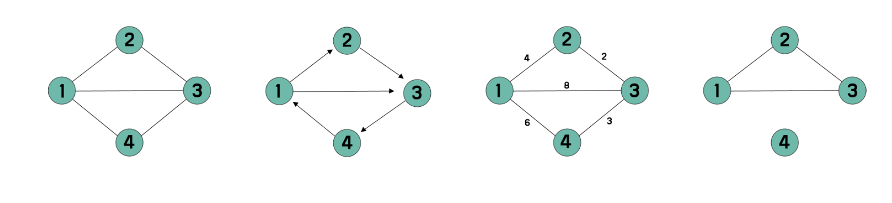
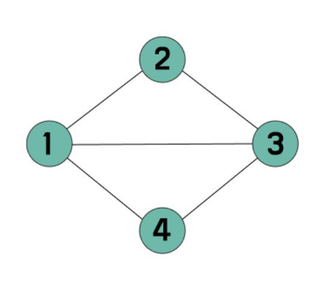

# 5. 그래프

### **그래프**
- 정점(Vertex)과 간선(Edge)으로 이루어진 데이터 구조
- 현실 세계의 관계나 연결 구조를 표현하는 데 유용 (예: 지도, SNS 친구 관계 등)

**주요** **용어**
- **정점**(Vertex) : 연결 대상이 되는 개체 또는 위치
- **간선**(Edge) : 정점 간의 연결
- **인접**(Adjacent) : 두 정점이 간선으로 직접 연결된 상태
- **차수**(Degree) : 정점에 연결된 간선의 수
- **경로**(Path) : 간선을 따라 이동하는 순서 (정점들의 나열)

### 그래프의 종류


- **방향** **그래프** ↔ **무방향** **그래프**
- **가중치** **그래프** ↔ **비가중치** **그래프**
- **연결** **그래프** ↔ **비연결** **그래프**

**표현** **방식**

**1. 인접 행렬 (Adjacency Matrix)**
- 2차원 배열로 정점 간 연결 여부 표시
- 간선이 많을 때는 비효율적 (공간 복잡도 O(V²))
  - 대칭을 이룬다.



```javascript
const matrix = [
  [0, 0, 0, 0, 0], // 0번 인덱스는 사용 X
  [0, 0, 1, 1, 1], // 1번: 2, 3, 4
  [0, 1, 0, 1, 0], // 2번: 1, 3
  [0, 1, 1, 0, 1], // 3번: 1, 2, 4
  [0, 1, 0, 1, 0], // 4번: 1, 3
];
```

**2. 인접 리스트 (Adjacency List)**
- 각 정점마다 연결된 정점 목록을 저장
- 대부분의 경우 효율적 (공간 복잡도 O(V + E))

```javascript
const graphList = {
  1: [2, 3, 4],
  2: [1, 3],
  3: [1, 2, 4],
  4: [1, 3],
};
```

- <span color="red">**BFS DFS와 크게 연관되어있다.**</span>
