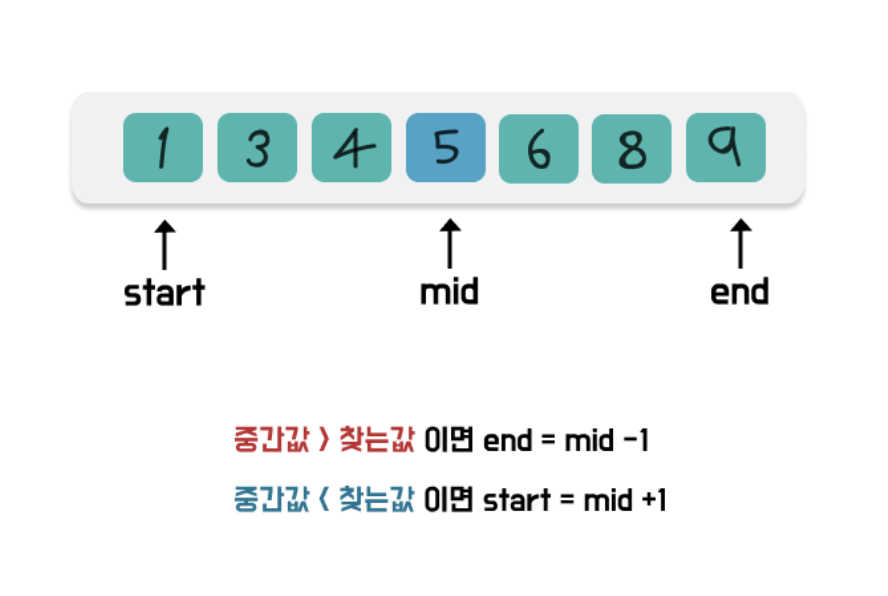

## 이분 탐색 (Binary Search)
검색 범위를 줄여 나가며 원하는 데이터를 검색하는 알고리즘
시간복잡도는 탐색할 범위를 절반으로 줄여서 탐색하므로 O(logn)
> 이분탐색의 큰 핵심 장점
> - 중간값만 계산하며 찾는 값을 비교하여 맞지않은 곳은 아예 버리기 때문.


만약 찾는값보다 중간값이 작으면, 중간값 기준 오른쪽에 있기 때문에, 중간값+1 ~ end만 살림
만약 찾는값보다 중간값이 크면, 중간값 기준 왼쪽에 있기 때문에, start ~ 중간값-1만 살림

- 이분 탐색 ? 크게 어렵지 않다?
- 목표 : 중간값이 내가 찾는값이 될 때까지 자른다.
  - 리턴하는 경우는 중간값 === 찾는값 인 경우만 존재.
- 실제 배열이 있는 것이 아님 ⇒ 변수로 기억해야하는 구조
```javascript
function solution(target, arr){
  let answer;
  let start = 0;
  let end = arr.length - 1;

  while(start <= end){//못찾을 경우 어디까지 탐색할지에 대한 기준
    //1. 중간값
    let mid = Math.floor((start+end)/2);

    //2. 찾는값과 중간값의 관계에 따른
    if(target === arr[mid]){
      answer = mid;
      break;
    }else if(target < arr[mid]){
      end=mid - 1;
    }else{
      start = mid +1;
    }

  }

  return answer;
}

console.log(solution(32, [1,2,32,44,56]))
```

> 문제 유형 특징
> - 입력값이 굉장히 크거나 (예 - 1,000,000,000)
> - 어떤 조건을 만족하는 최소값또는 최댓값을 구하는 문제

---
