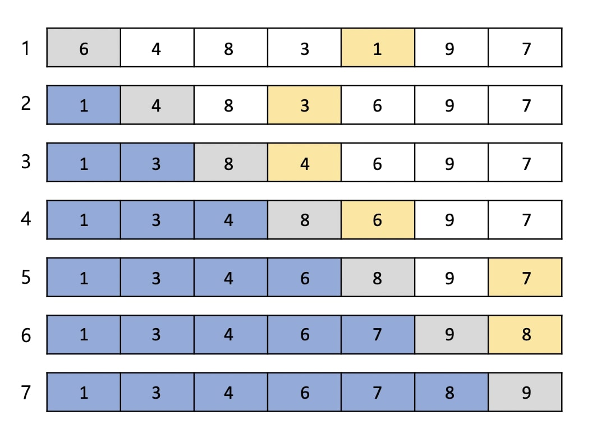
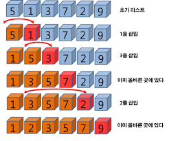
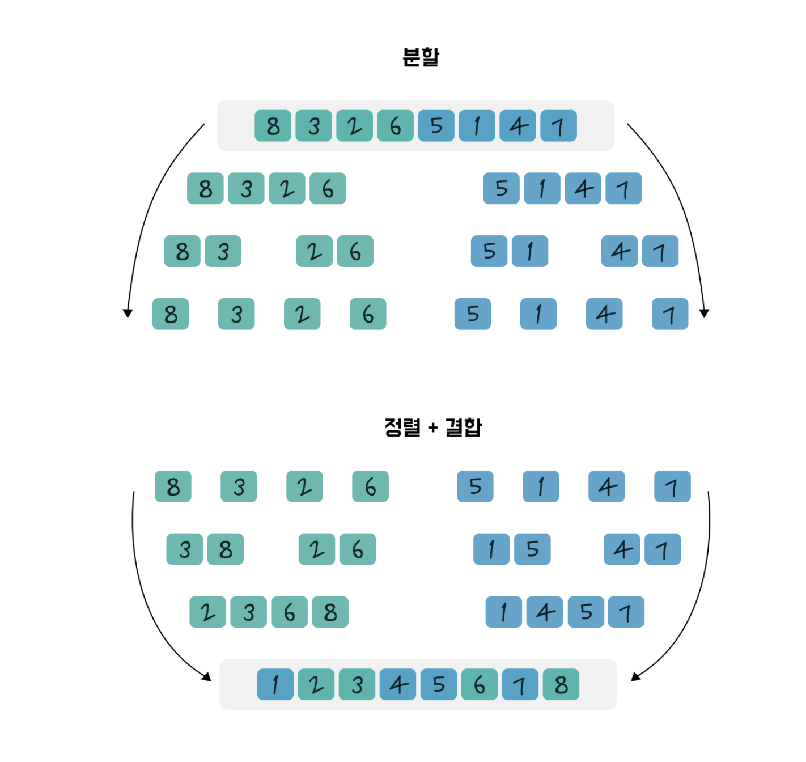
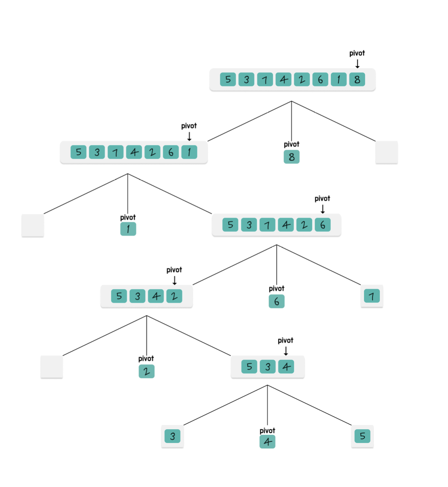

### 버블 정렬 → 거품 처럼 올라간다. 라는 의미에서 나온 버블 정렬
앞에서부터 비교하며 큰값을 뒤로 보낸다.
- 순차적으로 바로 옆의 데이터와 비교해서 옆의 데이터가 더 크면 자신과 위치를 바꾸며 정렬
  - 시간복잡도 : O(n²)
- 최선의 경우 데이터가 정렬된 상황이므로 이동횟수는 0이지만 비교횟수는 N²/2이다.
  - 최악의 경우를 가정하면 다른 정렬 알고리즘보다 성능이 나쁘다.
```javascript
function bubbleSort(array){
  let len = array.length

  for(let i=0;i<len;i++){
    for(let j=0;j<len;j++){
      if(array[j] > array[j+1]) [array[j], array[j+1]]=[array[j+1], array[j]]
    }
  }
}
```
---
### 선택 정렬 → 작은 수를 선택한다. 해서 선택정렬
- 데이터의 처음부터 끝까지 훑으면서 가장 작은 값을 찾아 첫번째 데이터와 자리를 바꾸고, 두번째로 작은 값을 찾아 두번째의 데이터와 자리를 바꾸며 구현하는 알고리즘
  1. 청소를 하지 않은 구역에서 가장 작은 데이터를 찾기
  2. 앞(청소한 구역)으로 옮긴다
  3. 청소한 구역 길이 + 1 인 인덱스 부터 청소 안한 구역 지정
  - 시간복잡도 : O(n²)
- 2개의 반복문으로 N²/2회 비교한다.
- 실제 정렬에 사용되는 데이터의 수가 많은 경우 유용하다.

```javascript
function selectionSort(array){
  const n = array.length -1;

  for(let i=0;i<n;i++){
    let minIndex = i

    //1. 가장 값이 작은 수 인덱스 찾아서 갱신
    for(let j=i+1;j<n;j++){
      if(array[j]<array[minIndex]){
        minIndex = j;
      }

      //2. 최솟값 인덱스가 현재 위치가 아니라면 변경해주기(중복 연산 제거)
      if(minIndex !== i){
        [array[i], array[minIndex]] = [array[minIndex], array[i]]
      }
    }

    return array;
  }


}
```

### 삽입 정렬
→ 알맞은 곳에 삽입한다.
- 데이터를 순차적으로 정렬하면서 현재 값을 정렬되어있는 값들과 비교해 적합한 위치로 삽입하는 방식
  - 시간복잡도 : O(n²)
- 선택 정렬 알고리즘이 비교 횟수가 많고 데이터의 이동 횟수는 적은 반면,
  삽입 정렬 알고리즘은 비교 횟수가 적고 상대적으로 데이터의 이동 횟수는 많은 편이다.


```javascript
function insertionSort(array){
  const n = array.length;

  for(let i=1;i<n;i++){
    let current = array[i];
    let j = i-1; //1. 현재 인덱스보다 앞에 있는 인덱스 [시작부분]

    //2. 현재값보다 앞에 위치한 요소들 확인 (앞에 있는 요소들이 정렬되어있을 거라는 것을 낙관적으로 보장하는 상태)
    while(j>=0 && array[j] > current){
      array[j+1] = array[j]; //3. 오른쪽 한칸 이동. (삽입될수도있으니 자리를 비켜주는거임)
      j--;//점차 왼쪽으로 감

    }

    array[j+1] = current;

  }

  return array;

}
```

### 병합 정렬
병합 정렬은 분할 정복이라는 알고리즘 디자인 기법에 근거해 만들어졌다.
- 문제를 해결 1)문제를 분할 → 2)분할된 둘로 나누는 과정을 반복한다.→ 3)해결한 결과 결합
시간복잡도 : O(NlogN)

병합하는 과정에서 leftIndex, rightIndex를 사용하여 비교하기 때문에, 투 포인터 라는 개념을 사용한다.
- 투포인터는 코딩테스트에도 많이 나오는 개념이라고 함.
```javascript
function mergeSort(array){
  if(array.length == 1){
    return array;
  }
  const legnth = array.length;

  const middle = Math.floor(length/2)
  const left = array.slice(0, middle);
  const right = array.slice(middle);

  //머지(분할(), 분할())
  return merge(mergeSort(left), mergeSort(right))

}

function merge(left, right){
  const result = [];
  let leftIndex = 0;
  let rightIndex = 0;

  while(leftIndex < left.length && rightIndex < right.length){
    if(left[leftIndex] < right[rightIndex]){
      result.push(left[leftIndex]);
      leftIndex++;
    }else{
      result.push(right[rightIndex]);
      rightIndex++;
    }
  }

  return result.concat(left.slice(leftIndex).concat(right.slice(rightIndex)));

}
```
<table header-row="true">
<tr>
<td>단계</td>
<td>호출</td>
<td>left</td>
<td>right</td>
<td>비고</td>
</tr>
<tr>
<td>1</td>
<td>mergeSort(\[5,3,8,4\])</td>
<td>\[5,3\]</td>
<td>\[8,4\]</td>
<td>처음 호출</td>
</tr>
<tr>
<td>2</td>
<td>mergeSort(\[5,3\])</td>
<td>\[5\]</td>
<td>\[3\]</td>
<td>왼쪽 분할</td>
</tr>
<tr>
<td>3</td>
<td>mergeSort(\[5\])</td>
<td>-</td>
<td>-</td>
<td>길이 1 → 반환</td>
</tr>
<tr>
<td>4</td>
<td>mergeSort(\[3\])</td>
<td>-</td>
<td>-</td>
<td>길이 1 → 반환</td>
</tr>
<tr>
<td>5</td>
<td>mergeSort(\[8,4\])</td>
<td>\[8\]</td>
<td>\[4\]</td>
<td>오른쪽 분할</td>
</tr>
<tr>
<td>6</td>
<td>mergeSort(\[8\])</td>
<td>-</td>
<td>-</td>
<td>길이 1 → 반환</td>
</tr>
<tr>
<td>7</td>
<td>mergeSort(\[4\])</td>
<td>-</td>
<td>-</td>
<td>길이 1 → 반환</td>
</tr>
</table>
```javascript
                 [5,3,8,4]
               /            \
          [5,3]              [8,4]
         /     \            /     \
      [5]     [3]        [8]     [4]
        ↑        ↑          ↑        ↑
       merge     merge      merge     merge
           ↖     ↗              ↖     ↗
            [3,5]                [4,8]
                   ↖          ↗
                 merge([3,5],[4,8])
                         ↓
                   [3,4,5,8]

```

## 퀵 정렬
- 퀵 정렬도 분할 정복에 근거해 만들어졌다.
- left 는 정렬대상의 가장 왼쪽, right는 오른쪽, pivot은 기준
  - pivot의 왼쪽에는 pivot보다 작은 값, 오른쪽에는 큰 값들이 위치하는 방식으로 정렬
  - 나눌 것이 더 이상 없을 경우 모두 합친다.(정복)
- 시간 복잡도 O(NlogN)
  - 최악의 경우 O(n\^2)
방법 1. 새로운 배열을 생성하여 정렬

```javascript
function quickSort(array){

  if(array.length <= 1) return array;

  //배열의 가장 끝을 pivot으로 선정
  const pivot = array[array.lengh - 1];
  const left = []; //pivot보다 작은
  const right = []; //pivot보다 큰

  for(let i of array){
    if(pivot < i){
      right.push(i)
    } else if(i<pivot)  {
      left.push(i)
    }

  }

  return [...quickSort(left), pivot, ...quickSort(right)]
}
```

방법 2. 기존(in-place)배열 활용
- 새 배열을 사용하지 않기 때문에 공간복잡도 : 메모리 효율이 좋음.
