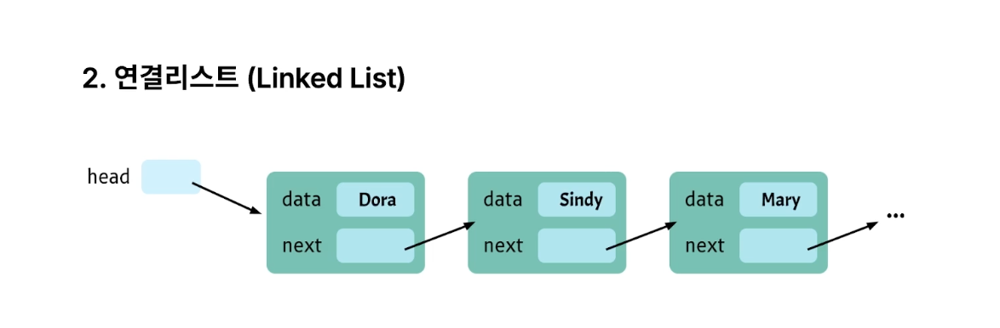

### 스택(Stack)
- 스택은 입력 출력을 한 방향으로 제한한 자료구조이다.
- 데이터의 삽입과 삭제가 한쪽에서만 이루어진다.
- 후입선출(LIFO : Last In-First Out)구조 → 나중에 넣은 데이터가 먼저 나온다.
- 스택을 구현하는 방법 
  1. Array(배열)
  2. linkedList(연결리스트)
- 스택의 기본연산
  - `push` : 데이터를 저장
  - `pop ` : 최신 데이터를 제거하며 반환
  - `peek` : 스택의 top 원소를 제거 없이 반환한다.

### 스택 코드
- push, pop만으로 stack 자료구조를 직접 만들어야한다.
```javascript
class Stack {
  constructor() { //생성자
    this.array = [];
  }

  push(value){
    this.array.push(value);
  }

  pop(){
    return this.array.pop();
  }

  peek(){
    return this.array[this.array.length-1]
  }

}
```

- stack 자료구조 사용하기
```javascript
const stack = new Stack();
stack.push("A");
stack.push("B");
stack.push("C");
stack.push("D");
const pop = stack.pop();
console.log(pop); //"D"

const top = stack.peek();
console.log(top);//"C"

console.log("stack",stack); //[ "A", "B", "C" ]
```


## 스택 문제 풀이
[스택](https://www.notion.so/2ddee90a967f80f2ba63de8c77af2e0f)

---
### 큐 (Queue)
- 큐는 대기행렬이다.
- 스택과 달리 데이터의 삽입과 한쪽끝에서 이루어지고, 삭제는 반대쪽 끝에서 일어난다.
- 스택과 반대로 선입선출(FIFO : First In First Out) → 먼저 넣은 데이터가 먼저 나온다.
- 큐의 기본연산 
  - `enqueue, insert` : 큐에 원소를 삽입한다.
  - `dequeue, remove` : 원소를 큐에서 삭제하고 반환한다.
  - `peek` : 큐의 헤더 원소를 제거 없이 반환한다.

```javascript
class Queue{
  constructor(){
    this.array = [];
  }

  enqueue(value){
    this.array.push(value);
  }

  dequeue() {
    return this.array.shift();
  }

  peek(){
    return this.array[0];
  }
}
```

### 연결리스트

- 데이터를 저장할 수 있는 공간안에 다음 데이터의 주소를 가지고 있다.
- 배열과 비교
  - 배열은 한번 정하면 늘리거나 줄일수없다(불변형)
    - 배열 리스트 중간에 원소 삽입 삭제 시 다수의 데이터를 옮겨야됨.
    - 하지만! 연결”리스트”는 서로 독립적인 공간에 데이터 주소만 연결해주기 때문에 이동없이 중간에 데이터 삽입 삭제 가능
      - 단점 : 특정 요소를 찾을때 전체를 순회하기 때문에 검색기간이 느리다.
- 노드 : 연결이 가능한 객체
this.head : head가 가리키는 노드 그자체
this.tail : 가장 끝에 있는 노드 그 자체
```javascript
class Node {
  constructor(value){
    this.value = value;
    this.next = null;
  }
}

class LinkedList {

  /*
  *맨 처음에는 헤드가 곧 꼬리다.
  *자바스크립트의 객체 저장은 항상 주솟값이 저장됩니다.
  */
  constructor(value){
    this.head = {
      value:value,
      next:null,
    };

  this.tail = this.head;
  this.length = 1;

  }

  /*
  *맨앞에 넣는다.
  */
  prepend(value){
    const newNode = new Node(value);
    newNode.next = this.head;
    //기존에 있던 this.head가 가리키던 값을 newNode.next가 가리켜야되기 때문에.
    this.head = newNode;
    this.length++;
  }

  /*
  *맨뒤에 넣는다.
  */
  append(value){
    const newNode = new Node(value);
    this.tail.next = newNode;
    this.tail = newNode;
    this.length++;
  }
  findNode(index){
    let count = 0;
    let currentNode = this.head;
    while(count !== index){
      currentNode = currentNode.next;
      count++;
    }
    return currentNode;
  }
  insert(index, value){
    if(index===0){
      this.prepend(value);
      return;
    }
    if(index>=this.length){
      this.append();
      return;
    }
    const newNode = new Node(value);
    const prevNode = this.findNode(index-1);
    const nextNode = prevNode.next;
    newNode.next = nextNode; // 2번
    prevNode.next = newNode;
    this.length ++;

  }

  remove(index){
    const prevNode = this.findNode(index-1);
    const removeNode = prevNode.next;
    prevNode.next = removeNode.next;
    this.length--;

  }

  printList(){
    const array = [];
    let currentNode = this.head;
    while(currentNode !== null){
      array.push(currentNode.value);
      currentNode = currentNode.next;
    }
    console.log(array);
  }

}
```

> 왜 newNode.next = this.head 인가요?
> this.head는 가장 앞단에 있는 노드를 가리키고 있다.
> 가리킨다는 뜻은 주소값을 가지고 있다는 뜻이기도 하다.
> 때문에 newNode.next에 head의 주솟값을 넣어주는 행위이다.

> JS에서 말하는 리스트는 연결리스트인가?


### 스택을 연결리스트로 규현하기
```javascript
class Node {
  constructor(value){
    this.value = value;
    this.next = null;
  }
}

class Stack {
  constructor(){
    this.top = null;
    this.bottom = null;
    this.length = 0;
  }

  push(value){
    const newNode = new Node(value);
    if(this.length === 0){
      this.top = newNode;
      this.bottom = newNode;
    }else{
      const oldTop = this.top;
      this.top = newNode;
      this.top.next = oldTop
    }

    this.length++;
  }
  pop(){
    if(!this.top) return null;

    const removedNode = this.top;
    if(this.top === this.bottom){
      this.top = null;
      this.bottom == null;
    }else{
      this.top = this.top.next;
    }

    this.length--;
    return removedNode;

  }

  peek(){
    return this.top;
  }
}
```

### 큐를 연결리스트로 구현하기
```javascript
class Node {
  constructor(value){
    this.value = value;
    this.next = null;
  }
}

class Queue{
  constructor(){
    this.first = null;
    this.last = null;
    this.length = 0 ;

  }

  enqueue(value){
    const newNode = new Node(value);
    if(this.length ==0){
      this.first = newNode;
      this.last = newNode;
    } else{
      const oldLast = this.last;
      oldLast.next = newNode;
      this.last = newNode;
    }
    this.length ++;
  }

  dequeue(){
    if(!this.first) return null;

    const removedNode = this.first;

    if(this.first === this.last){
      this.first = null;
      this.last = null;
    }else{
      this.first = this.first.next;
    }

    this.length--
    return removedNode;
  }

  peek(){
    return this.first;
  }

}
```
---


---

`this`가 뭐냐면
```javascript
class LinkedList {
  constructor(value) {
    this.head = { ... };
  }
}
```
여기서 `this`는:  “지금 만들어지고 있는 LinkedList 인스턴스 자기 자신”
```javascript
const list = new LinkedList(10);
```
이 시점에서 내부적으로는 이렇게 생각하면 돼: `this === list` 즉, `this.head = ...` 은 사실상 `list.head = ...` 이랑 완전히 같은 말이야.

## 그럼 `this.head = {}`는 뭐냐?
```javascript
this.head = {
  value: value,
  next: null,
};
```
이거 보고 네가 든 의문 👇
> “이거 그냥 객체 넣는 거 아님? 주소 연결은 어디 있음?”
이 질문이 정확한 질문이야.
---
## 3️⃣ JS에서 객체 = 주소(참조값)
### 🔥 핵심 규칙 하나만 기억하면 됨
> JS에서 객체(Object)는 변수에 ‘값 자체’가 아니라‘객체가 있는 메모리 주소(참조값)’가 저장된다.
즉,
```javascript
this.head = { value: 10, next: null };
```
이건 실제로는 이런 의미야:
```text
this.head ──▶ 0xA
               │
               ▼
           { value: 10, next: null }
```
- `{}` 는 힙 메모리에 생성됨
- `this.head`에는 그 객체의 주소값이 들어감
👉 C/C++에서 포인터 쓰는 거랑 개념적으로 동일
👉 JS가 포인터 문법을 안 보여줄 뿐이야
---
## 4️⃣ 그래서 “연결 리스트가 주소로 연결된다”는 말은 맞다
예를 들어:
```javascript
const node1 = { value: 1, next: null };
const node2 = { value: 2, next: null };

node1.next = node2;
```
이 상태는:
```text
node1 ──▶ 0xA
           │
           ▼
        { value: 1, next: 0xB }

node2 ──▶ 0xB
           │
           ▼
        { value: 2, next: null }
```
👉 `next`에 객체를 넣는 것 = 주소를 넣는 것
JS에서는:
- `next = node2` ❌ 객체 복사
- `next = node2` ✅ node2의 참조값 복사
---
## 5️⃣ 그럼 `Node` 클래스 쓰는 거랑 뭐가 달라?
### 지금 constructor 코드
```javascript
this.head = {
  value: value,
  next: null,
};
```
### Node 클래스를 쓰면
```javascript
this.head = new Node(value);
```
둘의 본질은 완전히 동일해.
차이점은:
- `{}` → 즉석 객체
- `Node` → 구조를 강제하고 의미를 명확히 함
```javascript
class Node {
  constructor(value) {
    this.value = value;
    this.next = null;
  }
}
```
👉 연결 방식, 메모리 구조, 주소 개념 전부 동일
---
## 6️⃣ 네가 헷갈린 이유 (아주 정상임)
- C/Java 자료구조 설명에서는
  - “노드는 주소를 가리킨다”
- JS 코드에서는
  - `{}` 가 보여서
  - “값 넣는 것처럼” 보임
하지만 사실은:
> JS는 ‘주소’라는 개념을객체 참조(reference)로 추상화해서 숨겨둔 언어야.
---
## 7️⃣ 한 문장으로 완전 정리
> `this.head = {}` 는
  “head가 새로 만들어진 노드 객체의 주소(참조) 를 가리키게 한다”는 뜻이고,
  연결 리스트의 ‘주소 연결’ 개념과 100% 동일하다.
## 1️⃣ JS에서 주소값은 존재하지만, 접근 불가
JS 엔진(V8 등) 내부에서는 당연히:
- 객체 → 힙 메모리 어딘가에 있음
- 내부적으로는 실제 주소(포인터) 가 존재함
하지만 👇
❌ 그 주소를 숫자나 문자열로 읽을 방법은 없음
❌ `&obj`, `obj.address` 같은 건 없음
```javascript
const a = {};
console.log(a); // 객체는 나오지만 주소는 절대 안 나옴
```
👉 이건 보안 + 엔진 최적화 때문이야
(주소 노출 = 메모리 공격, 엔진 최적화 불가)
---
## 2️⃣ 그럼 JS는 “같은 객체”를 어떻게 구분해?
### ✅ 참조 동일성(reference identity)으로만 판단
```javascript
const a = {};
const b = a;
const c = {};

a === b // true
a === c // false
```
👉 이 `===` 비교가 내부적으로는
“같은 주소를 가리키고 있냐?” 를 보는 거야.
즉:
- 주소값은 못 봄
- 주소가 같은지는 비교 가능
---
## 3️⃣ “본인의 주소” 대신 쓰는 실전 패턴들
### 🔹 1. 참조 그 자체를 키로 사용 (가장 중요)
```javascript
const map = new Map();
const obj = {};

map.set(obj, "나는 obj");
map.get(obj); // "나는 obj"
```
여기서 `obj`가 key로 되는 이유는?
👉 객체의 참조(= 주소 정체성) 가 key이기 때문
📌 주소값을 몰라도
📌 “이 객체는 이 객체다”는 보장됨
---
### 🔹 2. WeakMap (GC-safe 주소 대체 수단)
```javascript
const wm = new WeakMap();
const node = {};

wm.set(node, { visited: true });
```
- WeakMap의 key는 객체 참조
- 객체가 GC되면 자동 제거
👉 연결 리스트 / 트리 / 그래프에서“노드 정체성” 관리할 때 최고
---
### 🔹 3. Symbol / ID를 직접 붙이기 (가짜 주소)
```javascript
const node = {};
node._id = Symbol("node-id");
```
또는
```javascript
let id = 0;
node.id = ++id;
```
👉 이건 주소가 아니라 식별자
👉 필요할 때만 사용 (디버깅, 직렬화)
---
## 4️⃣ 왜 JS는 주소를 숨겼을까? (중요)
객관적으로 이유는 3가지야.
### 1. 보안
- 주소 노출 → 메모리 공격 가능
- 브라우저 언어에선 치명적
### 2. GC 최적화
- 주소를 노출하면
  - 객체 이동(compaction) 불가
  - 성능 급락
### 3. 엔진 자유도
- 엔진이 마음대로 메모리 배치 가능
- JIT / escape analysis / stack allocation 가능
📌 실제로 V8은
“힙에 있어야 할 객체를 스택에 둘 수도 있음”
(최적화 시)
---
## 5️⃣ 그럼 연결 리스트는 주소 없이 어떻게 가능해?
이제 핵심 질문으로 돌아오면 👇
```javascript
node.next = otherNode;
```
이건 사실상:
```text
node.next ──▶ (otherNode의 참조)
```
- 주소 숫자를 몰라도
- 참조를 그대로 복사하면 연결됨
👉 포인터 언어에서:
```c
node->next = otherNode;
```
👉 JS에서는:
```javascript
node.next = otherNode;
```
개념적으로 100% 동일
---
## 6️⃣ “본인의 주소를 알고 싶다”는 생각 자체가 JS에선 불필요
JS식 사고로 바꾸면 이거야:
- ❌ “내 주소가 뭐지?”
- ✅ “나를 가리키는 참조가 같은가?”
그래서 JS 자료구조 문제에서도:
- 주소 출력 ❌
- 참조 비교 / Map / WeakMap / Set ✅
---
## 마지막 한 줄 요약 (이건 꼭 기억해)
> JavaScript에서는
  객체의 주소값은 절대 알 수 없고,
  대신 참조 동일성(===)으로만 정체성을 판단한다.
  연결 리스트에서 `next`는 주소가 아니라
  주소를 대신하는 참조 그 자체다.
지금 질문 흐름 보면
다음은 거의 여기야 👇
“그럼 JS에서 깊은 복사 / 얕은 복사는 정확히 뭐가 다른가?”
원하면 그거 바로 이어서 설명해줄게.

> JavaScript에서는
  객체의 주소값은 절대 알 수 없고,
  대신
참조 동일성(===)으로만 정체성을 판단한다.
