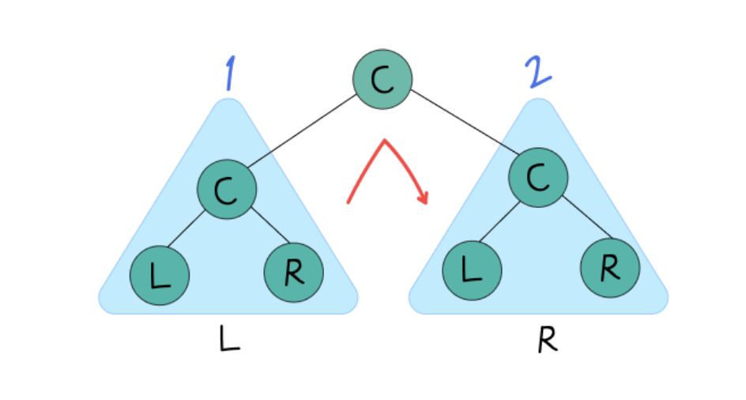

# 6. 트리

- 원본: https://www.notion.so/315ee90a967f80068aafd4bad4ef7b7a

## 트리 기본
- 계층적 관계를 표현하는 자료구조
- 루트/부모/자식/형제/리프 노드로 구성

### 종류
1. 이진 트리: 각 노드가 최대 2개 자식
2. 포화 이진 트리: 리프 제외 모든 노드가 자식 2개
3. 완전 이진 트리: 마지막 레벨이 왼쪽부터 채워짐

## 이진 트리 순회
- 전위(preorder): `C -> L -> R`
- 중위(inorder): `L -> C -> R`
- 후위(postorder): `L -> R -> C`



```javascript
function preOrder(node, arr) {
  if (node !== null) {
    arr.push(node.index);
    preOrder(node.left, arr);
    preOrder(node.right, arr);
  }
  return arr;
}

function inOrder(node, arr) {
  if (node !== null) {
    inOrder(node.left, arr);
    arr.push(node.index);
    inOrder(node.right, arr);
  }
  return arr;
}

function postOrder(node, arr) {
  if (node !== null) {
    postOrder(node.left, arr);
    postOrder(node.right, arr);
    arr.push(node.index);
  }
  return arr;
}
```

## 이진 탐색 트리(BST)
- 왼쪽 서브트리 값 < 현재 노드 값
- 오른쪽 서브트리 값 > 현재 노드 값

### 삽입
- 현재 노드보다 작으면 왼쪽, 크거나 같으면 오른쪽으로 내려가 빈 자리 삽입

### 삭제 케이스
1. 리프 노드 삭제
2. 자식 1개인 노드 삭제
3. 자식 2개인 노드 삭제

자식 2개 삭제 핵심:
1. `current.right`로 이동
2. 그 서브트리의 왼쪽 끝(가장 작은 값) 탐색
3. 해당 값을 현재 노드에 복사
4. 원래 replacement 노드를 트리에서 제거
